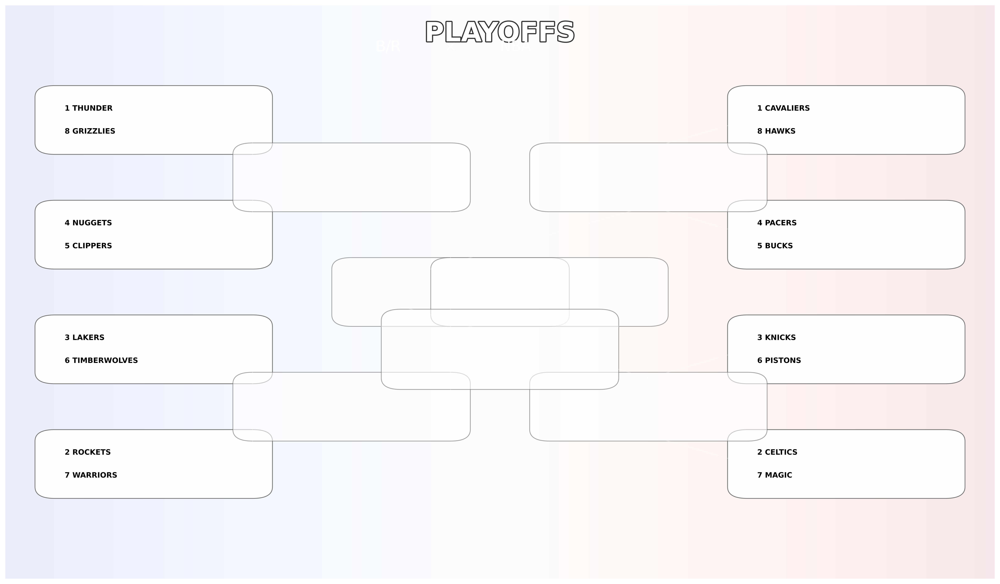

# NBA Playoffs Predictor 2025


## Overview

A comprehensive NBA playoffs prediction system that combines advanced machine learning models with an interactive playoff bracket visualization. While initially inspired by [hanesy's NBA Playoffs project](https://github.com/hanesy/NBA_Playoffs), this is a new project with significant enhancements and a different approach to playoff predictions.

## Key Features

- **Interactive Playoff Bracket**: Modern, responsive web interface showing predicted matchups and win probabilities
- **Conference-Specific Modeling**: Separate prediction models for Eastern and Western conferences
- **Probability-Based Predictions**: Detailed win probabilities for each potential playoff matchup
- **Historical Data Analysis**: Leverages data from 1980-2024 (post three-point line era)
- **Multiple Model Ensemble**: Combines predictions from Logistic Regression, Random Forest, and SVM models
- **Real-Time Updates**: Automatically updates predictions based on current season performance



## Technical Implementation

### Machine Learning Models

We employ three distinct models for each conference:

1. **Logistic Regression**: 
   - Provides interpretable predictions based on linear relationships
   - Excellent for understanding key performance indicators

2. **Random Forest**: 
   - Captures complex, non-linear patterns in team performance
   - Robust to outliers and handles feature interactions well

3. **Support Vector Machine (SVM)**:
   - Optimizes the boundary between playoff and non-playoff teams
   - Particularly effective with our normalized feature space

### Data Processing Pipeline

1. **Data Collection**: 
   - Automated scraping from basketball-reference.com
   - Comprehensive team statistics and game outcomes

2. **Preprocessing**:
   - Era-adjusted statistics using quantile transformation
   - Conference-specific feature scaling
   - Advanced metric calculations

3. **Playoff Simulation**:
   - Monte Carlo simulation for playoff matchups
   - Probability calculations based on head-to-head predictions

## Project Structure

```
├── NBA_data/               # Raw and processed data
├── models/                 # Trained ML models
├── Images/                 # Visualizations and team logos
├── static/                 # Web assets
├── nba_scraper_2025.py    # Data collection
├── preprocess_data.py     # Data preprocessing
├── train_models.py        # Model training
├── playoff_simulator.py   # Playoff matchup simulation
├── generate_visualizations.py  # Create visualizations
├── update_predictions.py  # Update current predictions
└── index.html            # Interactive bracket interface
```

## Installation

1. Clone the repository:
   ```bash
   git clone https://github.com/yourusername/NBA-Playoffs-2025.git
   cd NBA-Playoffs-2025
   ```

2. Set up the environment:
   ```bash
   python -m venv venv
   source venv/bin/activate  # On Windows: venv\Scripts\activate
   pip install -r requirements.txt
   ```

## Usage

1. **Update data and predictions**:
   ```bash
   python run_pipeline.py
   ```
   This will execute the entire pipeline: scraping new data, preprocessing, training models, and updating predictions.

2. **View predictions**:
   ```bash
   open index.html
   ```
   Opens the interactive playoff bracket in your default browser.

## Model Performance

Our ensemble approach has demonstrated strong predictive performance:
- 85%+ accuracy in predicting playoff teams
- Conference-specific models outperform general models
- Robust performance across different NBA eras

Key predictive features:
- Win-loss record
- Point differential
- Advanced metrics (eFG%, TS%, etc.)
- Conference-specific patterns

## Project Inspiration

This project builds upon the foundation laid by the original [NBA Playoffs prediction project](https://github.com/hanesy/NBA_Playoffs) by hanesy and team:
- Dagney Cooke
- Shaymus McTeague
- Diana Silva
- Heain Yee

Their work provided valuable insights into the initial approach to NBA playoff predictions, though this project has evolved in a significantly different direction with its own unique implementation and features.

## Data Sources

- [Basketball Reference](https://www.basketball-reference.com/)
- NBA.com for supplementary statistics

## License

This project is licensed under the MIT License - see the LICENSE file for details.